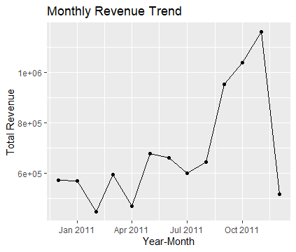
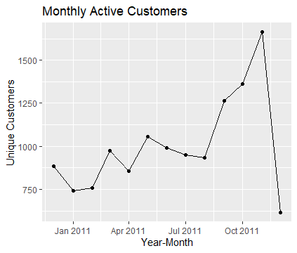
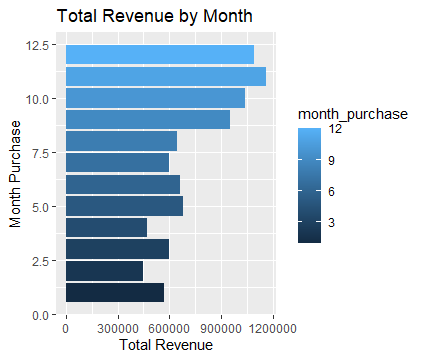
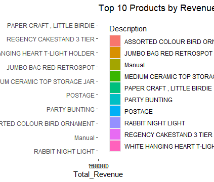
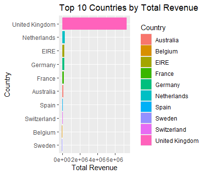
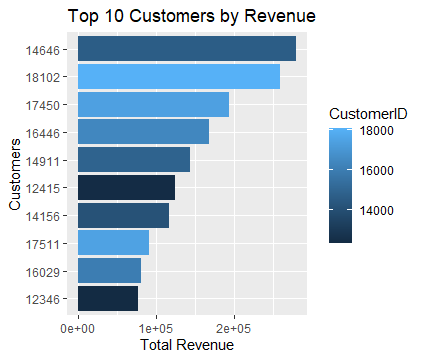
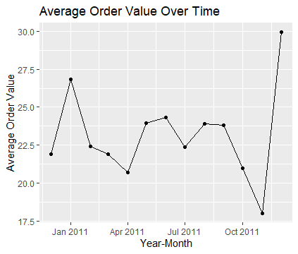

# Project Title 
Online-Retail-Sales-Analysis

# Project Overview
This project presents an exploratory data analysis of an e-commerce transactional dataset, the Online Retail Dataset, to uncover key sales patterns, customer behavior, and product performance. The dataset contains transaction-level records from an online retail store, including product purchases, customer identifiers, order quantities, prices, and purchase dates.
The primary objective of this project is to analyze sales trends over time and identify the factors that contribute to revenue generation. The analysis focuses on cleaning the raw transactional data, engineering relevant features such as monthly sales periods and revenue metrics, and visualizing important business indicators.
Using R and libraries such as tidyverse, ggplot2, and lubridate, the project explores key analytical questions including monthly revenue trends, customer activity patterns, top-performing products, leading markets by country, and high-value customers.
The insights generated from this analysis help highlight seasonal sales behavior, identify the most valuable products and customers, and provide data-driven recommendations that could support strategic decision-making for an e-commerce business.

# Tools Used
•	R
•	lubridate: For date handling 
•	dplyr: For data manipulation
•	tidyr: For data reshaping 
•	ggplot2: For data visualization

# Data Description
Source: Online Retail Dataset (CSV file obtained from Kaggle)
The dataset contains 406,829 rows and 8 original variables, representing transactional records from an online retail store. Each row corresponds to a single product purchased within a transaction.
Original Dataset Variables:
•	InvoiceNo: Unique transaction identifier 
•	StockCode: Unique product code 
•	Description: Name or description of the product 
•	Quantity: Number of units purchased in a transaction 
•	InvoiceDate: Date and time when the transaction occurred 
•	UnitPrice: Price per unit of the product 
•	CustomerID: Unique identifier for each customer 
•	Country: Country where the customer is located 

# Engineered Variables (Created During Analysis)
To support the sales analysis, additional variables were created using R:
•	purchase_amount: Total revenue per transaction (Quantity × UnitPrice) 
•	purchase_year: Year of purchase extracted from InvoiceDate 
•	month_purchase: Month of purchase extracted from InvoiceDate 
•	year_month: Monthly time period used for sales trend analysis 
•	total_orders: Total number of orders within a time period 
•	average_order_value: Average revenue per order (total_revenue ÷ total_orders) 
These engineered features enable deeper analysis of revenue trends, customer behavior, and seasonal sales patterns.

# Data Cleaning
Before performing the analysis, the dataset was cleaned to ensure accuracy and reliability of the results. The following preprocessing steps were carried out using R:
•	Removed rows with missing values in CustomerID and Description to ensure that all transactions could be linked to identifiable customers and products. 
•	Removed transactions where Quantity ≤ 0 or UnitPrice ≤ 0, as these values typically represent product returns or invalid transactions. 
•	Created a new variable purchase_amount to calculate total revenue per transaction (Quantity × UnitPrice). 
•	Converted InvoiceDate to the appropriate date-time format to allow time-based analysis. 
•	Engineered additional time-based features including purchase_year, month_purchase, and year_month to support monthly trend analysis. 
•	Generated aggregated metrics such as total_orders and average_order_value to analyze purchasing behavior and order value trends. 
•	Grouped and summarized the data to create datasets used for revenue trends, customer activity analysis, product performance, and geographic sales analysis. 

# Business Questions
The analysis was guided by the following key business questions:
•	Which month generated the highest revenue, and are there noticeable seasonal sales patterns? 
•	What is the overall sales trend over time? 
•	Which products contribute the most to total revenue? 
•	Which countries generate the highest sales revenue? 
•	Is the number of active customers increasing or decreasing over time? 
•	What data-driven strategies could the company implement to increase sales and improve revenue performance?

# Key Insights 
•	November generated the highest revenue, exceeding 1.16 million, likely driven by increased demand during the holiday shopping season.
•	Sales increased steadily from July and peaked in November, after which revenue declined. This pattern suggests strong seasonal purchasing behavior leading into the holiday period.
•	The product Paper Craft Little Birdie generated the highest total revenue, indicating strong customer demand for this item within the product catalog.
•	The United Kingdom accounted for the majority of total revenue, contributing over 6 million in sales, making it the company's most important market.
•	Customer activity gradually increased throughout the year before declining slightly toward the end of the observed period, reflecting similar seasonal patterns in purchasing behavior.

# Visualization
Charts were created using ggplot2 to show: Monthly Revenue Trend. Monthly Active Customers. Total Revenue by Month. Top 10 Products by Revenue. Top 10 Countries by Total Revenue. Top 10 Customers by Revenue. Average Order Value Over Time

 

The chart illustrates the total monthly revenue generated during 2011. Revenue fluctuates in the early months but increases significantly toward the end of the year, showing strong sales growth. The final drop may indicate partial data for the last month.

 

This chart shows the number of unique customers purchasing each month. Customer activity generally increases toward the later months of the year, suggesting growing engagement. However, there is a sharp drop in the final month, which may indicate incomplete data or reduced activity.

 

This horizontal bar chart displays the total revenue generated for each month of the year. Revenue shows a clear upward trend from the beginning of the year, with the highest earnings recorded in November and December. This pattern suggests strong seasonal demand during the festive period, which could be useful for planning inventory and marketing campaigns.

 

This chart ranks the top 10 products contributing the most to overall revenue. It shows that items such as PAPER CRAFT, LITTLE BIRDIE and REGENCY CAKESTAND 3 TIER are among the best performers, with several party and home décor products also appearing prominently. Understanding these top-performing products helps identify popular categories and supports better decisions on stock replenishment and product promotion.

 

This chart highlights the geographic distribution of revenue. The United Kingdom generates the highest total revenue by a significant margin, followed by other European countries such as the Netherlands, EIRE, and Germany. This indicates that the United Kingdom is the company’s primary market.

 

The top 10 customers chart identifies the customers contributing the most to overall revenue, enabling targeted customer relationship management and the development of loyalty programs.

 

This chart shows how the average order value changed each month in 2011. The values fluctuate throughout the year but remain mostly between 20 and 25, indicating relatively stable customer spending per order. A noticeable increase appears toward the end of the year.

# Conclusion and Recommendation
The analysis revealed that the United Kingdom generates the majority of the company's revenue, making it the most important market for the business. Additionally, sales showed a clear seasonal pattern, with revenue steadily increasing from mid-year and peaking during the October–November period.
Based on these findings, the company should prioritize targeted marketing campaigns, promotions, and customer retention strategies within the United Kingdom to maximize revenue. Furthermore, replicating the promotional strategies used during the high-performing months could help maintain stronger sales performance throughout the year.

# Author
Franklin Chisom  
Data Analyst | SQL, Python, Power BI, & R Enthusiast
